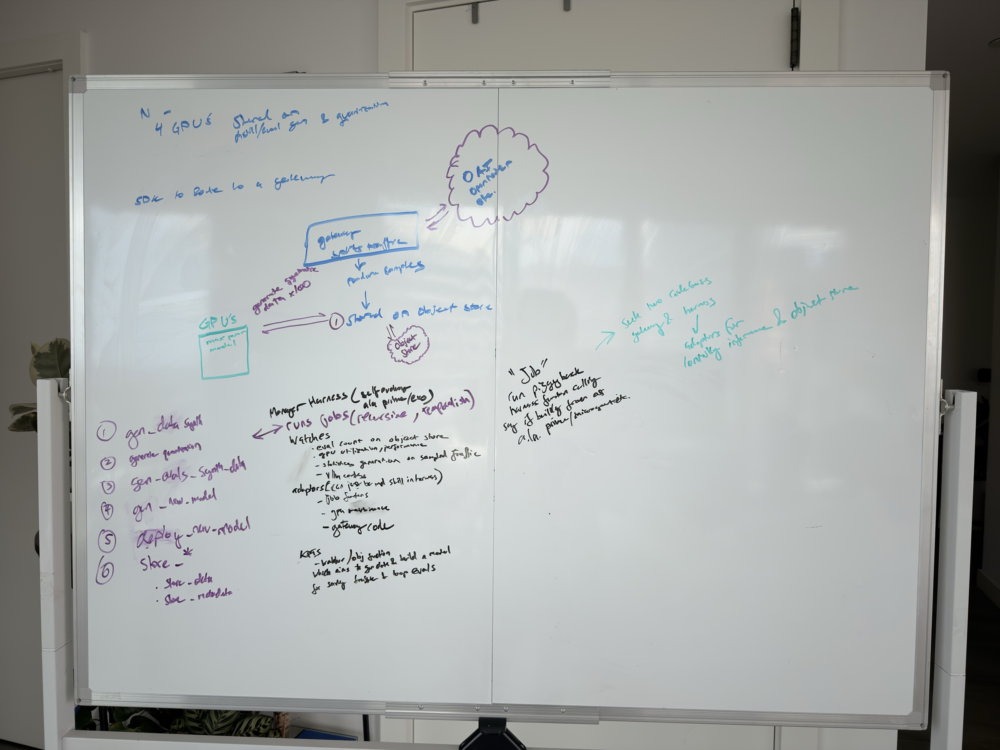

# Milk Harness

Private Milk Infrastructure repository for the bounded self-iteration loop and disposable GPU jobs shown in the architecture whiteboard.



The unmodified source is [`docs/architecture/IMG_4239.HEIC`](docs/architecture/IMG_4239.HEIC), SHA-256 `86866e513f6028b2c81b79615d8815506cf3eb67498c881685ace466d3c69a23`. The image is the architecture authority; no OCR transcript is used as one.

This repository contains two separately released and credentialed programs:

- `jobs`: a one-shot executor that consumes creator-only [`milk-gateway`](https://github.com/milkinfrastructure/milk-gateway) launch outbox records through read-only control-store credentials, reserves one conservative campaign budget, runs the exact Modal or Baseten GPU provider selected by the confirmed eval config, records bounded evidence, reconciles ambiguity, and verifies teardown.
- `release`: a one-shot image builder that uses only its CPU-only x86 host's Docker socket, with private Milk GHCR write access and no provider, R2-authority, or route-signing credentials.

The existing Exo harness is the manager. [`tools/exo`](tools/exo) installs one typed `milk` tool whose only actions are status, reconcile, and run a host-confirmed pass. A fixed host command dispatches this workflow; Exo never receives provider credentials, free-form command arguments, or approval authority.

Production has one non-secret eval authority: canonical `milk.eval.v1` JSON in `MILK_EVAL_CONFIG_JSON` and its SHA-256 in `MILK_EVAL_ID`. It contains the existing v5 confirmed manifest, the exact non-secret gateway config, and the remaining store locations. The workflow derives every prior non-secret setting from that document; raw provider, registry, signing, traffic, and object-store credentials remain individual masked secrets. The retained dispatch input name `confirmed_run_config_sha256` carries the outer eval ID for compatibility with the Exo host.

There is no always-on manager, provider plugin framework, queue, scheduling database, or third repository. R2 typed records are coordination authority. The one production workflow runs a gateway `tick --once` job before a separately credentialed jobs image; each process exits after one bounded pass. Fixed R2 leases serialize both gateway ticks and provider passes. Workflow concurrency is defense in depth.

Jobs verifies the gateway frontier, outbox, claim, image, provider choice, and budget before creation. It returns only bounded evidence-addressed winner and teardown results. The workflow invokes the exact gateway image afterward with a separate control writer and teardown-only route reader. Neither provider process receives gateway config, capture, route, signing, or control-write authority.

`provider_runtime.gpu_provider` is the per-eval `modal` or `baseten` choice bound into the confirmed config hash. Only that provider's API credential enters the jobs container. The gateway's Baseten-primary/Modal-fallback winner authority remains fixed so existing route and admission verification stay provider-neutral.

Standalone Baseten winner and Modal mutation entrypoints are disabled. Their explicit provider lifecycles are callable only through jobs after a matching gateway claim, shared budget reservation, immutable provider selection, and live lease check.

Private image policy:

- all final images are built for `linux/amd64` from clean Milk checkouts on a CPU-only x86 host; the local Mac GPU is not used;
- canonical references are the private digest-addressed `milk-student-train`, `milk-student-branch`, `milk-teacher-gpt-oss`, and `milk-jobs` packages under `ghcr.io/milkinfrastructure`;
- provider copies must resolve to the admitted digest and may not be rebuilt by Modal, Baseten, or Cloudflare;
- the jobs executor exact-matches the image in every gateway launch receipt before provider creation.

Every image release must emit a `milk.private-image-admission.v1` receipt binding the clean Milk source commit, committed archive digest, private repository, immutable OCI index and `linux/amd64` manifest, local-socket pinned BuildKit, SLSA v1 provenance, and SPDX SBOM. Personal `ghcr.io/shantanujoshi/*` images are baseline evidence only and can never be admitted as Milk releases.

Paid work uses one campaign authority bound to the exact Baseten project and Modal workspace, environment, and app. Both providers share a $1,000 absolute ceiling, an $850 new-launch cutoff, and a protected $150 running-work/teardown reserve. Provider creates require pessimistic reservations bound to that provider's identity and immutable price receipt. Terminal usage is recorded as conservative `accounted` cost and `committed_microusd`, not provider-invoice or observed-billing truth; ambiguity retains the reservation. Expired provider pricing blocks only new reservations for that provider without blocking reconciliation or teardown.

Qualification status on 2026-08-28: the private repository is published and Actions remain disabled. The split train/branch runtime, outbox consumer, provider jobs paths, scheduler, and gateway result handoff pass offline tests. The previous main revision has a verified v3 five-image release; this revision validates and can publish that immutable authority while ignoring its retired planner at runtime. New releases use the four-image v4 inventory. No paid end-to-end run, canary, rollback, or zero-GPU proof has occurred. This repository is not production-qualified.

After committing a clean harness checkout, build all four private harness images from a credential-clean, builder-local Docker context:

```sh
deploy/build-images.sh \
  ghcr.io/milkinfrastructure/milk-gateway@sha256:GATEWAY_DIGEST \
  /absolute/path/to/new-build-evidence
```

The script derives the source revision and reproducible build epoch from the commit, creates a fresh local `docker-container` builder from a pinned BuildKit digest, pins the Dockerfile frontend by digest, and rejects remote Docker contexts and ambient provider, registry, model, store, OpenAI, or Codex credentials. It pushes only the four hardcoded private Milk packages.

The evidence directory retains BuildKit metadata, verified OCI indexes and manifests, immutable references, and SHA-256/byte-count observations of build output. Raw build output is deleted. A separate restricted operational-log archive is still a release gate; see [`docs/reference/README.md`](docs/reference/README.md).

In a separate shell containing only `MILK_EVIDENCE_R2_*` create/get authority, publish the exact release and four admission receipts once:

```sh
python3 -m milk_harness.publish_image_admission \
  --release-dir /absolute/path/to/new-build-evidence
```

The publisher rejects builder, registry, provider, and other store credentials. Scheduled jobs receive only the printed release SHA-256 plus the exact student-train, student-branch, teacher, and jobs image digest references; they load and verify the immutable receipts from evidence R2 before any provider call.
